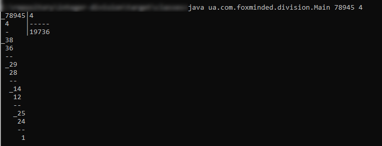
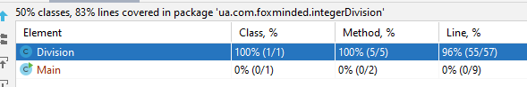

`Task 4 - Integer division`
Write an application integer-division that divides numbers and prints result into console. + JUnit tests(!!!).

Example of result:


`Instuction how run applicatian Integer division:`

Download and install java  https://www.java.com/ru/download/manual.jsp

Your mast put file Main.java and Division.java in 
>*\ua\com\foxminded\integerdivision\

For exampl 

>C:\ua\com\foxminded\integerdivision\

* Run Command Prompt

 >set path=%path%;C:\Program Files\Java\jdk1.*.*\bin

* This tells the system where to find JDK programs.

 >javac C:\ua\com\foxminded\integerdivision\*.java*

* This runs javac.exe, the compiler. You should see nothing but the next system prompt...

 >C:\ua\com\foxminded\integerdivision\
```
javac has created the Division.class and Main.class file. You should see Main.java, Division.java and Main.class, Division.class among the files.
```

* This makes C:\ the current directory.

 >cd C:\

* This runs the Java interpreter. Then you can input sentence.

>java ua.com.foxminded.integerdivision.Main


```
If the system cannot find javac, check the set path command. If javac runs but you get errors, cell developers.
```
* You version.


`Unit tests`
 
 