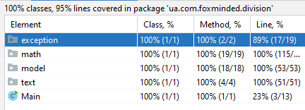

`Task 4 - Integer division`
Write an application integer-division that divides numbers and prints result into console. + JUnit tests(!!!).

Example of result:


`Instuction how run applicatian Integer division:`

Download and install java  https://www.java.com/ru/download/manual.jsp

Your mast put file Main.java
>*\ua\com\foxminded\division\

Your mast put file Exception.java
>*ua\com\foxminded\division\exception

Your mast put file Divider.java
>*ua\com\foxminded\division\math

Your mast put file Result.java
>*ua\com\foxminded\division\model

Your mast put file Formatter.java
>*ua\com\foxminded\division\text


For exampl 

>C:\ua\com\foxminded\division\

* Run Command Prompt

 >set path=%path%;C:\Program Files\Java\jdk1.*.*\bin

* This tells the system where to find JDK programs.

 >javac C:\ua\com\foxminded\division\*.java*
 >javac C:\ua\com\foxminded\division\*\*.java*

* This runs javac.exe, the compiler. You should see nothing but the next system prompt...

 >C:\ua\com\foxminded\division\*
```
javac has created the Divider.class and Main.class, Exception.class, Result.class, Formatter.class file. You should see Divider.class, Main.class, Exception.class, Result.class, Formatter.class  
and Divider.java, Main.java, Exception.java, Result.java, Formatter.java among the files.
```

* This makes C:\ the current directory.

 >cd C:\

* This runs the Java interpreter. Then you can input sentence.

>java ua.com.foxminded.division.Main 78945 4


```
If the system cannot find javac, check the set path command. If javac runs but you get errors, cell developers.
```
* You version.


`Unit tests`
 
 